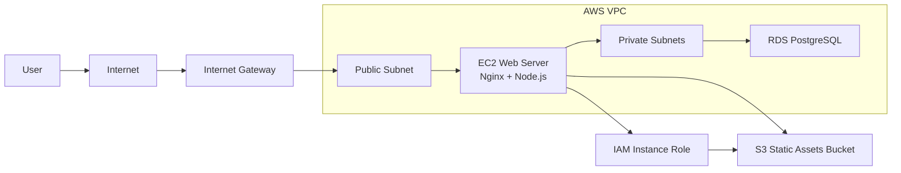

# AWS Web Application Deployment with Terraform and Ansible

Provision an AWS VPC, EC2 instance, RDS PostgreSQL database, S3 static asset bucket, and EC2 IAM role with Terraform. Then configure the EC2 instance with Ansible to run Nginx as a reverse proxy for a Node.js application.

## Architecture



## What Terraform Creates

- VPC with two public subnets and two private subnets across two availability zones.
- Internet gateway and public route table for the EC2 web server.
- Security groups for HTTP/HTTPS/SSH access to EC2 and PostgreSQL access from EC2 to RDS.
- EC2 instance running Ubuntu 22.04 with an IAM instance profile.
- RDS PostgreSQL instance in private subnets.
- Private, versioned S3 bucket populated with files from `static/`.
- Generated Ansible inventory at `ansible/inventory.ini`.

## What Ansible Configures

- Installs Nginx and Node.js 20.
- Copies the sample Node.js app from `app/` to `/opt/<project_name>`.
- Creates a locked-down `nodeapp` system user.
- Configures a systemd service for the Node app.
- Configures Nginx to proxy port `80` to the app on `127.0.0.1:3000`.
- Injects RDS and S3 details from Terraform outputs into the app environment.

## Prerequisites

- AWS CLI configured with credentials for the target account.
- Terraform `>= 1.6`.
- Ansible installed locally.
- An SSH key pair available locally, for example `~/.ssh/id_rsa.pub`.

## Deploy

1. Copy the example variables file.

   ```powershell
   Copy-Item terraform.tfvars.example terraform.tfvars
   ```

2. Edit `terraform.tfvars`.

   Set `ssh_cidr` to your public IP in CIDR format, such as `198.51.100.25/32`. Keep `db_password` out of the file if you prefer environment variables.

3. Set the database password.

   ```powershell
   $env:TF_VAR_db_password = "replace-with-a-strong-password"
   ```

4. Provision AWS resources.

   ```powershell
   terraform init
   terraform plan
   terraform apply
   ```

5. Configure the EC2 instance.

   ```powershell
   ansible-playbook -i ansible/inventory.ini ansible/playbook.yml
   ```

6. Open the application URL.

   ```powershell
   terraform output web_url
   ```

## Useful Commands

Check the Node.js service on EC2:

```powershell
ssh ubuntu@$(terraform output -raw web_public_ip)
sudo systemctl status tf-ansible-webapp
sudo journalctl -u tf-ansible-webapp -f
```

Check Nginx:

```powershell
sudo nginx -t
sudo systemctl status nginx
```

Destroy the environment:

```powershell
terraform destroy
```

## Notes

- The S3 bucket is private by default. The EC2 IAM role can read objects from it.
- RDS is not publicly accessible and only accepts PostgreSQL traffic from the EC2 security group.
- The sample app displays infrastructure metadata but does not connect to the database. Add database client code in `app/` if you want live DB reads/writes.
- `skip_final_snapshot = true` and `deletion_protection = false` are set for lab/demo teardown convenience. Change these before production use.
